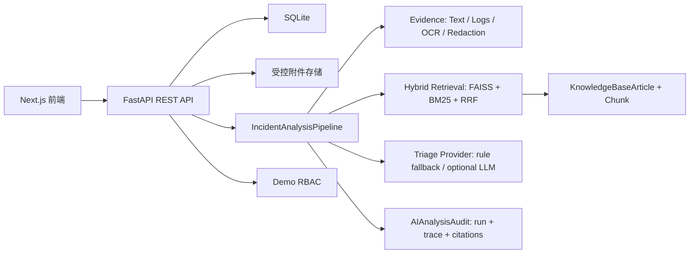
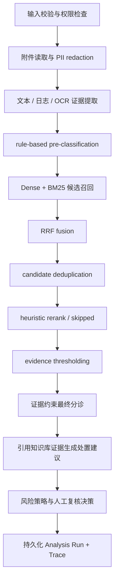

# 智维工单 / AI IncidentOps Copilot

AI IncidentOps Copilot 是一个面向 IT 运维与安全场景的智能工单平台作品集。项目采用 Next.js、FastAPI 与 SQLite 构建，支持工单提交、附件处理、任务流转、人工复核、分析记录和数据看板，并提供默认离线可运行、证据驱动、可测试的分析工作流。

项目使用 synthetic seed / fixture benchmark 数据进行演示与回归验证，不包含真实企业数据。相关评估结果用于验证离线工作流与证据引用规则，不代表线上业务效果。

## 当前实现能力

- 文本、日志、截图 OCR 证据提取：从用户描述、运行日志和截图中提取诊断信息，识别 ERROR/WARN、HTTP 4xx/5xx、异常名、timeout/database/unauthorized 等信号。
- PII redaction：进入 trace、UI 摘要和分析记录前脱敏邮箱、手机号、Bearer/JWT/API Key、密码、Cookie/Session，可配置内网 IP。
- 本地 Hybrid Retrieval：KnowledgeBaseChunk 按边界切块，使用 FAISS 向量检索、BM25 关键词检索、RRF 融合和启发式重排。
- 证据约束分诊：默认 `rule_fallback`，输出 provider、rationale、evidence ids、chunk ids、uncertainty 和人工复核原因。
- 可回放分析运行：每次分析生成 run_id、trace_id、stage traces、provider、index version、corpus hash、候选来源、最终引用和与上次 run 的差异。
- 演示环境访问控制：前端通过 Demo Persona 传递 `X-Demo-User-Id`，Requester 仅可访问自己的工单与附件，Admin 可访问管理端接口；缺少演示身份时，受保护接口返回 401。
- 评估体系：30 条 synthetic golden cases，覆盖负例、冲突例、小图 OCR 路径和 OCR 失败路径，输出 retrieval、triage、latency、provider 使用等指标，并设置非零质量门槛。

## 架构



## Incident Analysis Pipeline



每个 stage 保存 provider、耗时、状态、输入/输出摘要和错误信息。高危、安全类、低证据、OCR 失败、低置信度会进入人工复核。

## Hybrid Retrieval

1. 知识库文章被切为约 520 字符 chunk，保留约 80 字符 overlap。
2. tokenizer 保留中文词、英文词、HTTP 状态码、异常名、ORA/SQLSTATE、ECONNRESET 等诊断 token。
3. Dense 召回默认使用本地 hash embedding + FAISS。
4. Lexical 召回使用 BM25。
5. RRF 融合后做去重和 heuristic rerank。
6. 返回 chunk 级 evidence excerpt、dense_score、lexical_score、fusion_score、rerank_score、final_score。

## 默认离线配置与可选扩展

| 能力 | 默认实现 | 说明 |
| --- | --- | --- |
| OCR | `pytesseract_ocr` | 本地 OCR，readiness 检查 Python 包、Tesseract 可执行文件与所需语言包；不可用时记录降级状态。 |
| 向量索引 | `local_hash_embedding_fallback` + FAISS | 默认使用可重复的本地向量生成方式构建离线索引。 |
| 关键词检索 | `bm25_lexical` | 基于诊断 token 的本地关键词检索。 |
| 融合 | `rrf_fusion` | 使用 Reciprocal Rank Fusion 融合向量与关键词候选。 |
| 重排 | `heuristic_reranker` | 基于本地规则的候选去重与排序。 |
| 分诊 | `rule_fallback` | 基于证据约束的离线规则分诊与人工复核决策。 |
| 可选扩展 | `sentence_transformers` | 显式配置后可尝试加载；不可用时保留降级原因。 |

## 数据处理与演示访问控制

- 原附件保存在受控上传目录，不再通过公开静态目录暴露。
- 附件下载走 `GET /api/tickets/{ticket_id}/attachments/{attachment_id}/download` 并进行访问控制。
- 进入分析 trace、日志、检索 query、UI 摘要的内容默认执行 PII 脱敏。
- 当前访问控制采用 Demo Persona，用于展示身份边界、附件访问限制和越权测试；生产环境可替换为 OIDC/JWT 等认证方案。
- 前端会自动把当前 Persona 写入 `X-Demo-User-Id` 请求头；使用 curl、Postman 或脚本直接访问受保护 API 时，需要手动带上该请求头，例如 `X-Demo-User-Id: 1` 或 `X-Demo-User-Id: 7`。

## 数据库与迁移

```bash
cd backend
.venv/bin/alembic upgrade head
```

旧 SQLite 升级使用 Alembic 补字段。重置 demo 数据会清空 demo 表：

```bash
cd backend
.venv/bin/alembic upgrade head
.venv/bin/python -m app.seed --reset
```

## 本地运行

```bash
# 后端
cd backend
python3.11 -m venv .venv
.venv/bin/python -m pip install -r requirements.txt
.venv/bin/alembic upgrade head
.venv/bin/python -m app.seed --reset
.venv/bin/python -m uvicorn app.main:app --reload

# 前端
cd frontend
npm install
npm run dev
```

默认 `requirements.txt` 不安装 `sentence-transformers`，Docker 和 CI 使用本地 hash embedding fallback。需要实验可选 SentenceTransformer 时再执行：

```bash
cd backend
.venv/bin/python -m pip install -r requirements-optional.txt
EMBEDDING_PROVIDER=sentence_transformers .venv/bin/python -m app.scripts.ingest_kb --rebuild
```

访问：

- 前端：http://localhost:3000
- API：http://localhost:8000/api/health/ready

如果本机 3000 端口已被占用，可临时使用：

```bash
FRONTEND_PORT=3001 docker compose up --build
```

## Docker

```bash
docker compose up --build
```

后端镜像会安装 Tesseract OCR、英文和简体中文语言包，并在启动前执行 `alembic upgrade head`。默认 compose 文件显式设置 `OCR_REQUIRED_LANGUAGES=eng,chi_sim` 和 `BOOTSTRAP_DEMO_DATA=true`，仅用于本地演示：首次启动时会在迁移完成后导入 synthetic demo data 并重建本地 KB index。普通部署应关闭 demo bootstrap，并用显式 seed / ingest 命令管理演示数据。

`GET /api/health/ready` 会真实探测 OCR 状态：`pytesseract` Python 包、Tesseract executable、已安装语言、必需语言、ready 状态和 degraded reason。OCR 不可用时接口仍返回 200，但整体 `status` 为 `degraded`，表示服务可运行但截图 OCR 会降级。

## 测试与评估

```bash
cd backend
.venv/bin/python -m pytest
.venv/bin/ruff check .
.venv/bin/python -m app.scripts.ingest_kb --check
.venv/bin/python -m app.scripts.evaluate

cd ../frontend
npm run test
npm run lint
npm run build
```

评估输出：

- `artifacts/evaluation_report.json`
- `artifacts/evaluation_report.md`

当前评测集为 synthetic regression benchmark，用于检查检索、引用和人工复核规则是否发生退化。分类类指标反映固定 fixture 上的一致性；EvidencePrecision 与 UnsupportedCitationRate 用于识别证据引用质量问题。

## API 摘要

受保护 API 均使用演示身份头 `X-Demo-User-Id` 做 Demo RBAC。缺少该 header 会返回 401；Requester 与 Admin 的访问范围由 Demo Persona 决定。

- Tickets: `GET /api/tickets`, `POST /api/tickets`, `GET /api/tickets/{id}`, `PATCH /api/tickets/{id}`, `POST /api/tickets/{id}/reanalyze`
- Users: `GET /api/users`, `GET /api/users/{id}`，仅管理员 Demo Persona 可访问
- Analysis Runs: `GET /api/tickets/{id}/analysis-runs`, `GET /api/tickets/{id}/analysis-runs/{run_id}`, `GET /api/tickets/{id}/analysis-runs/{run_id}/trace`
- Attachments: `POST /api/tickets/{id}/attachments`, `GET /api/tickets/{id}/attachments/{attachment_id}/download`
- KB: `GET /api/kb`, `POST /api/kb/search`, `GET /api/kb/index/status`, `POST /api/kb/index/rebuild`
- AI Review: `GET /api/ai/reviews`, `PATCH /api/ai/reviews/{id}`
- Health: `GET /api/health/live`, `GET /api/health/ready`, `GET /api/system/status`

## Demo 演示路径

1. `/` 查看项目边界和真实 API 数据状态。
2. `/requester/tickets/new` 提交带日志的工单。
3. `/admin/tickets/{id}` 查看证据、chunk 来源、pipeline trace、run history。
4. `/admin/ai-review` 查看复核原因并覆盖判断。
5. `/requester/kb` 查看 index 状态和知识库文章。
6. `/admin/analytics` 查看统计。

## Roadmap

- 接入可选 SentenceTransformer 并缓存本地模型。
- 增加 CrossEncoder reranker，并在 evaluation 中单独标记。
- 接入 OpenAI-compatible structured-output triage provider，强校验 citation。
- 接入 Vision LLM 或更可靠 OCR pipeline。
- 替换 demo RBAC 为 OIDC/JWT。
- 使用 PostgreSQL + pgvector 或 Milvus/Qdrant 替换本地 FAISS。
