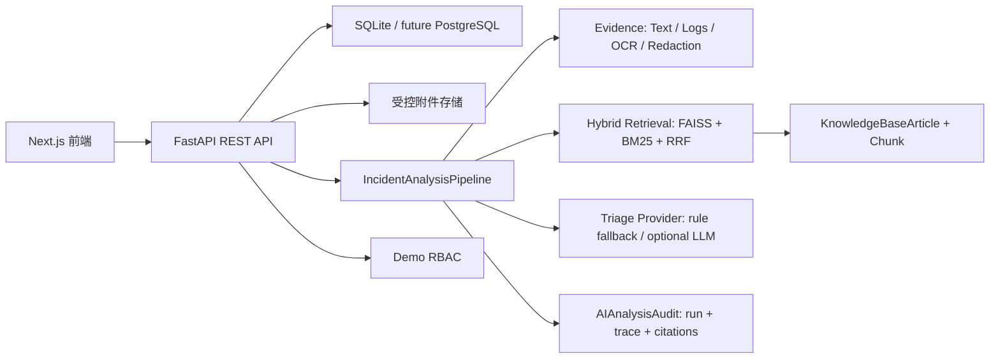
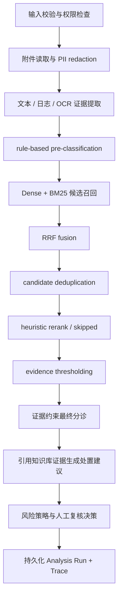

# 智维工单 / AI IncidentOps Copilot

IncidentOps Copilot v2 是一个用于作品集展示的智能运维工单平台。它保留 Next.js 前端、FastAPI API、SQLite 数据库、工单流转、处理任务、人工复核、分析记录和数据看板，并把原始演示逻辑升级为默认离线可运行、证据驱动、可测试的分析工作流。

本项目不接入真实企业系统，不包含真实企业数据，不宣称生产级认证或模型能力。所有 demo 数据均为 synthetic seed / fixture benchmark。

## 真实实现能力

- 文本、日志、截图 OCR 证据提取：日志解析 ERROR/WARN、HTTP 4xx/5xx、异常名、timeout/database/unauthorized 等信号；截图使用 Pillow + pytesseract OCR，失败时明确降级。
- PII redaction：进入 trace、UI 摘要和分析记录前脱敏邮箱、手机号、Bearer/JWT/API Key、密码、Cookie/Session，可配置内网 IP。
- 本地 Hybrid Retrieval：KnowledgeBaseChunk 按边界切块，FAISS dense retrieval + BM25 lexical retrieval + RRF 融合 + heuristic reranker。
- 证据约束分诊：默认 `rule_fallback`，输出 provider、rationale、evidence ids、chunk ids、uncertainty 和人工复核原因。
- 可回放分析运行：每次分析生成 run_id、trace_id、stage traces、provider、index version、corpus hash、候选来源、最终引用和与上次 run 的差异。
- Demo RBAC：`AUTH_MODE=demo`，前端通过 cookie 保存 Demo Persona，并在浏览器请求与 Next.js server fetch 中自动发送 `X-Demo-User-Id`；requester 只能访问自己的工单和附件，admin 可访问管理端 API。直接调用受保护 API 时必须显式提供该 header，缺失时返回 401，不会回退为管理员。
- 评估体系：30 条 synthetic golden cases，包含负例、冲突例、真实小图 OCR 成功路径和 OCR 失败降级路径，输出 retrieval、triage、latency、provider 使用指标，并有非零质量门槛。

## Fallback 与限制

- 默认 embedding 是 `local_hash_embedding_fallback`，它是可重复的本地 hash 向量，不是语义模型。
- 默认分诊是 `rule_fallback`，不是 LLM。
- 默认 reranker 是 `heuristic_reranker`，不是 CrossEncoder。
- OCR 是 pytesseract 文本提取，不是视觉大模型；截图质量差或未安装语言包时会降级。
- SentenceTransformer 是可选 embedding provider，必须显式启用；模型不可用时降级为 `local_hash_embedding_fallback`。
- OpenAI-compatible triage / vision 和 CrossEncoder reranker 当前只作为扩展方向或接口占位，不在默认离线版本中宣称可用。

## 架构



## Incident Analysis Pipeline



每个 stage 保存 provider、耗时、状态、输入/输出摘要和错误信息。高危、安全类、低证据、OCR 失败、低置信度会进入人工复核。

## Hybrid Retrieval

1. 知识库文章被切为约 520 字符 chunk，保留约 80 字符 overlap。
2. tokenizer 保留中文词、英文词、HTTP 状态码、异常名、ORA/SQLSTATE、ECONNRESET 等诊断 token。
3. Dense 召回默认使用本地 hash embedding + FAISS。
4. Lexical 召回使用 BM25。
5. RRF 融合后做去重和 heuristic rerank。
6. 返回 chunk 级 evidence excerpt、dense_score、lexical_score、fusion_score、rerank_score、final_score。

## Provider 配置

| 能力 | 默认 provider | 说明 |
| --- | --- | --- |
| OCR | `pytesseract_ocr` | 本地 OCR，readiness 会检查 Python 包、Tesseract 可执行文件和 `eng,chi_sim` 语言包；失败明确降级 |
| Embedding | `local_hash_embedding_fallback` | 本地 hash embedding，不是语义模型 |
| Lexical | `bm25_lexical` | 本地 BM25 |
| Fusion | `rrf_fusion` | Reciprocal Rank Fusion |
| Reranker | `heuristic_reranker` | 本地规则 rerank |
| Triage | `rule_fallback` | 离线规则分诊 |
| LLM / Vision | `none` | 当前默认禁用；OpenAI-compatible 是后续扩展点，未作为可用 provider 宣称 |
| Optional embedding | `sentence_transformers` | 显式配置后尝试加载；不可用时 trace 记录降级原因 |
| Optional CrossEncoder | 未实现 | 当前放入 roadmap，不在配置中作为已支持 provider |

## 数据隐私

- 原附件保存在受控上传目录，不再通过公开静态目录暴露。
- 下载走 `GET /api/tickets/{ticket_id}/attachments/{attachment_id}/download` 并做 RBAC。
- 进入分析 trace、日志、检索 query、UI 摘要的内容默认脱敏。
- Demo RBAC 不是生产级 OIDC/JWT，只用于展示权限边界和越权测试。前端 Persona 切换器支持 Requester A(id=1)、Requester B(id=2)、Admin(id=7)，并在 AppShell 顶部显示当前身份。前端会自动把当前 Persona 写入 `X-Demo-User-Id` 请求头；如果使用 curl、Postman 或脚本直接访问受保护 API，必须手动带上该请求头，例如 `X-Demo-User-Id: 1` 或 `X-Demo-User-Id: 7`。

## 数据库与迁移

```bash
cd backend
.venv/bin/alembic upgrade head
```

旧 SQLite 升级使用 Alembic 补字段。重置 demo 数据会清空 demo 表：

```bash
cd backend
.venv/bin/alembic upgrade head
.venv/bin/python -m app.seed --reset
```

## 本地运行

```bash
# 后端
cd backend
python3.11 -m venv .venv
.venv/bin/python -m pip install -r requirements.txt
.venv/bin/alembic upgrade head
.venv/bin/python -m app.seed --reset
.venv/bin/python -m uvicorn app.main:app --reload

# 前端
cd frontend
npm install
npm run dev
```

默认 `requirements.txt` 不安装 `sentence-transformers`，Docker 和 CI 使用本地 hash embedding fallback。需要实验可选 SentenceTransformer 时再执行：

```bash
cd backend
.venv/bin/python -m pip install -r requirements-optional.txt
EMBEDDING_PROVIDER=sentence_transformers .venv/bin/python -m app.scripts.ingest_kb --rebuild
```

访问：

- 前端：http://localhost:3000
- API：http://localhost:8000/api/health/ready

如果本机 3000 端口已被占用，可临时使用：

```bash
FRONTEND_PORT=3001 docker compose up --build
```

## Docker

```bash
docker compose up --build
```

后端镜像会安装 Tesseract OCR、英文和简体中文语言包，并在启动前执行 `alembic upgrade head`。默认 compose 文件显式设置 `OCR_REQUIRED_LANGUAGES=eng,chi_sim` 和 `BOOTSTRAP_DEMO_DATA=true`，仅用于本地演示：首次启动时会在迁移完成后导入 synthetic demo data 并重建本地 KB index。普通部署应关闭 demo bootstrap，并用显式 seed / ingest 命令管理演示数据。

`GET /api/health/ready` 会真实探测 OCR 状态：`pytesseract` Python 包、Tesseract executable、已安装语言、必需语言、ready 状态和 degraded reason。OCR 不可用时接口仍返回 200，但整体 `status` 为 `degraded`，表示服务可运行但截图 OCR 会降级。

## 测试与评估

```bash
cd backend
.venv/bin/python -m pytest
.venv/bin/ruff check .
.venv/bin/python -m app.scripts.ingest_kb --check
.venv/bin/python -m app.scripts.evaluate

cd ../frontend
npm run test
npm run lint
npm run build
```

评估输出：

- `artifacts/evaluation_report.json`
- `artifacts/evaluation_report.md`

当前 fixture benchmark 是 synthetic regression benchmark，不代表真实生产效果，也不代表泛化能力。报告中的 100% 分类类指标只说明当前 fixture 未退化；EvidencePrecision 和 UnsupportedCitationRate 会暴露弱引用问题。

## API 摘要

受保护 API 均使用演示身份头 `X-Demo-User-Id` 做 Demo RBAC。缺少该 header 会返回 401；请求人身份只能访问自己的工单和附件，管理员身份可访问管理端接口。这只是面试演示用身份边界，不是生产级认证方案。

- Tickets: `GET /api/tickets`, `POST /api/tickets`, `GET /api/tickets/{id}`, `PATCH /api/tickets/{id}`, `POST /api/tickets/{id}/reanalyze`
- Users: `GET /api/users`, `GET /api/users/{id}`，仅管理员 Demo Persona 可访问
- Analysis Runs: `GET /api/tickets/{id}/analysis-runs`, `GET /api/tickets/{id}/analysis-runs/{run_id}`, `GET /api/tickets/{id}/analysis-runs/{run_id}/trace`
- Attachments: `POST /api/tickets/{id}/attachments`, `GET /api/tickets/{id}/attachments/{attachment_id}/download`
- KB: `GET /api/kb`, `POST /api/kb/search`, `GET /api/kb/index/status`, `POST /api/kb/index/rebuild`
- AI Review: `GET /api/ai/reviews`, `PATCH /api/ai/reviews/{id}`
- Health: `GET /api/health/live`, `GET /api/health/ready`, `GET /api/system/status`

已删除旧版 `POST /api/ai/classify-ticket`、`POST /api/ai/suggest-resolution`、`POST /api/ai/retrieve-kb`。正式分析入口只能通过工单创建、附件上传后重分析、或 `POST /api/tickets/{id}/reanalyze`，以确保 Demo RBAC、PII redaction、Analysis Run/Trace 和 citation policy 生效。

## Demo 演示路径

1. `/` 查看项目边界和真实 API 数据状态。
2. `/requester/tickets/new` 提交带日志的工单。
3. `/admin/tickets/{id}` 查看证据、chunk 来源、pipeline trace、run history。
4. `/admin/ai-review` 查看复核原因并覆盖判断。
5. `/requester/kb` 查看 index 状态和知识库文章。
6. `/admin/analytics` 查看统计。

## 简历描述

智维工单：智能运维工单平台

技术栈：Next.js · FastAPI · 混合检索（RAG）· Docker

项目时间：2026.04 - 至今

- 独立开发面向 IT 运维与安全场景的智能工单平台，采用 Next.js + FastAPI 前后端分离架构，支持问题提交、附件上传、工单流转、处理任务、人工复核和数据看板。
- 搭建以证据为基础的智能分析流程：从用户描述、运行日志和截图中提取并脱敏关键信息，结合向量检索、BM25 关键词检索、RRF 融合和启发式排序查询知识库；分析结论和处理建议均附上对应证据。
- 实现分析过程追踪与历史结果记录、知识库版本管理、受控附件访问和演示环境身份权限隔离；构建测试数据集与自动评估工具，验证检索、证据引用和人工复核规则，并支持数据库迁移、Docker 部署和持续集成。

AI IncidentOps Copilot

- Built a full-stack AI-powered incident triage platform with requester and admin portals, supporting ticket submission, multimodal attachments, workflow tracking, and remediation task management.
- Implemented a local hybrid retrieval service and evidence-grounded classifier to categorize incidents, estimate severity, and generate cited resolution steps from internal knowledge-base chunks.
- Developed analytics dashboards for ticket volume, severity distribution, recurring issues, AI review status, and resolution workflow visibility using Next.js, FastAPI, SQLite/PostgreSQL-ready models, and Docker.

## Roadmap

- 接入可选 SentenceTransformer 并缓存本地模型。
- 增加 CrossEncoder reranker，并在 evaluation 中单独标记。
- 接入 OpenAI-compatible structured-output triage provider，强校验 citation。
- 接入 Vision LLM 或更可靠 OCR pipeline。
- 替换 demo RBAC 为 OIDC/JWT。
- 使用 PostgreSQL + pgvector 或 Milvus/Qdrant 替换本地 FAISS。

## 不应提交的运行产物

不要提交 `.env`、SQLite 数据库、上传附件、FAISS 索引、模型缓存、`node_modules`、虚拟环境、日志和 `__pycache__`。
